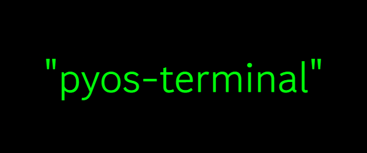

<p align="center">
  
  <br>
  <br>
  Pyos terminal is a simulation of a terminal made in python.
  <br>

<p align="center">
  


</p>

## Usage

```bash
"help", prints a list of commands.
"quit", exits the program.
"clear", clears the terminal.
"pyos", some text about the program.
"pyos --version", prints the version of the program.

```

## Contributing

Pull requests are welcome. For major changes, please open an issue first
to discuss what you would like to change.

Please make sure to update tests as appropriate.

## Details

This is a project FOR FUN only, that is, it was not made for commercial uses.
